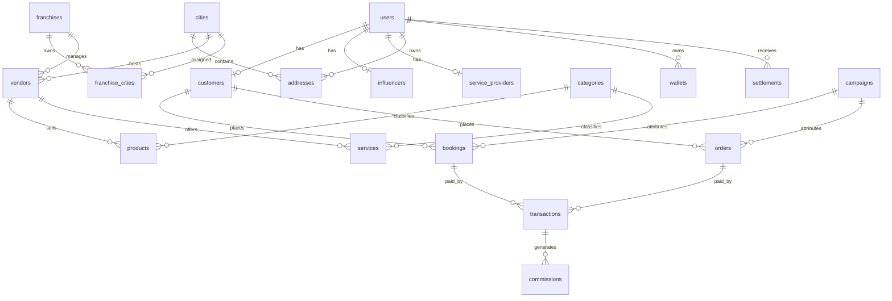
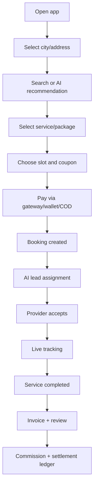
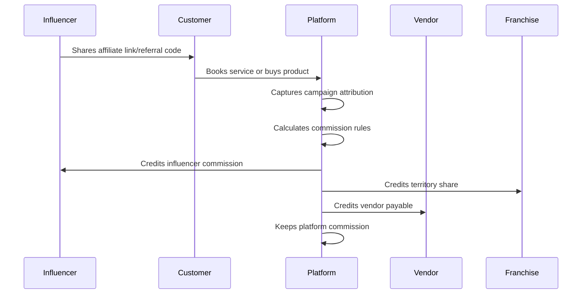
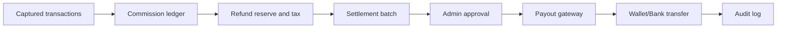

# ER Diagrams and User Flow Diagrams

## Core ER Diagram

```mermaid
erDiagram
  users ||--o| customers : has
  users ||--o| influencers : has
  users ||--o| service_providers : has
  users ||--o{ addresses : owns
  cities ||--o{ addresses : contains
  cities ||--o{ vendors : hosts
  franchises ||--o{ franchise_cities : owns
  cities ||--o{ franchise_cities : assigned
  franchises ||--o{ vendors : manages
  vendors ||--o{ products : sells
  vendors ||--o{ services : offers
  categories ||--o{ products : classifies
  categories ||--o{ services : classifies
  customers ||--o{ bookings : places
  customers ||--o{ orders : places
  bookings ||--o{ transactions : paid_by
  orders ||--o{ transactions : paid_by
  transactions ||--o{ commissions : generates
  users ||--o{ wallets : owns
  users ||--o{ settlements : receives
  campaigns ||--o{ bookings : attributes
  campaigns ||--o{ orders : attributes
```

## Customer Booking Flow

```mermaid
flowchart TD
  A[Open app] --> B[Select city/address]
  B --> C[Search or AI recommendation]
  C --> D[Select service/package]
  D --> E[Choose slot and coupon]
  E --> F[Pay via gateway/wallet/COD]
  F --> G[Booking created]
  G --> H[AI lead assignment]
  H --> I[Provider accepts]
  I --> J[Live tracking]
  J --> K[Service completed]
  K --> L[Invoice + review]
  L --> M[Commission + settlement ledger]
```

## Influencer Commission Flow

```mermaid
sequenceDiagram
  participant Influencer
  participant Customer
  participant Platform
  participant Vendor
  participant Franchise
  Influencer->>Customer: Shares affiliate link/referral code
  Customer->>Platform: Books service or buys product
  Platform->>Platform: Captures campaign attribution
  Platform->>Platform: Calculates commission rules
  Platform->>Influencer: Credits influencer commission
  Platform->>Franchise: Credits territory share
  Platform->>Vendor: Credits vendor payable
  Platform->>Platform: Keeps platform commission
```

## Admin Settlement Flow

```mermaid
flowchart LR
  A[Captured transactions] --> B[Commission ledger]
  B --> C[Refund reserve and tax]
  C --> D[Settlement batch]
  D --> E[Admin approval]
  E --> F[Payout gateway]
  F --> G[Wallet/Bank transfer]
  G --> H[Audit log]
```
